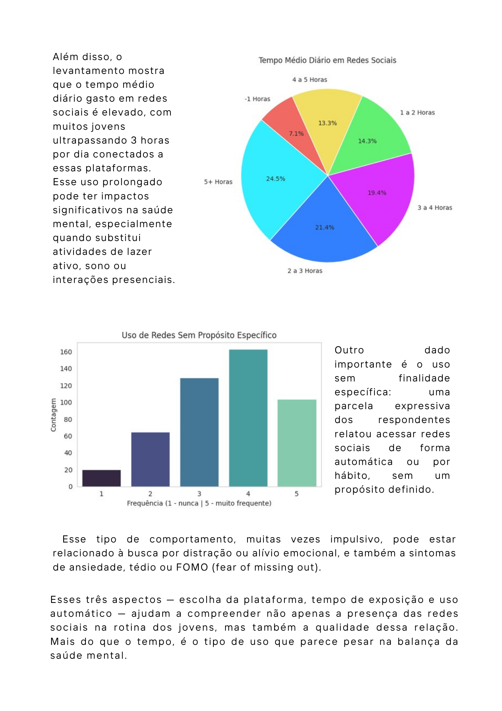
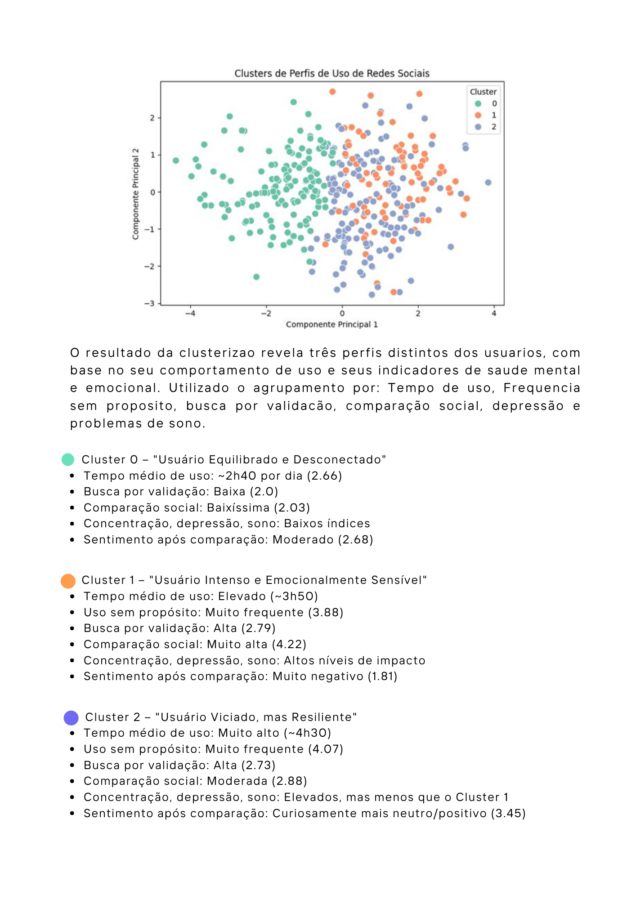

# Visualização de Dados e Storytelling

O trabalho desenvolvido para a disciplina de Visualização de Dados e Storytelling tem como principal objetivo explorar como histórias podem ser contadas por meio de dados e design. A proposta busca ir além dos formatos tradicionais de apresentação, como relatórios técnicos e gráficos estáticos, oferecendo uma abordagem mais envolvente, acessível e centrada no usuário não técnico.

Para isso, foram utilizados princípios de design visual e narrativa com dados, de modo a proporcionar ao leitor uma experiência mais intuitiva e impactante. A intenção é transformar os dados em narrativas compreensíveis, despertando interesse, facilitando a interpretação das informações e promovendo uma melhor tomada de decisão.

              